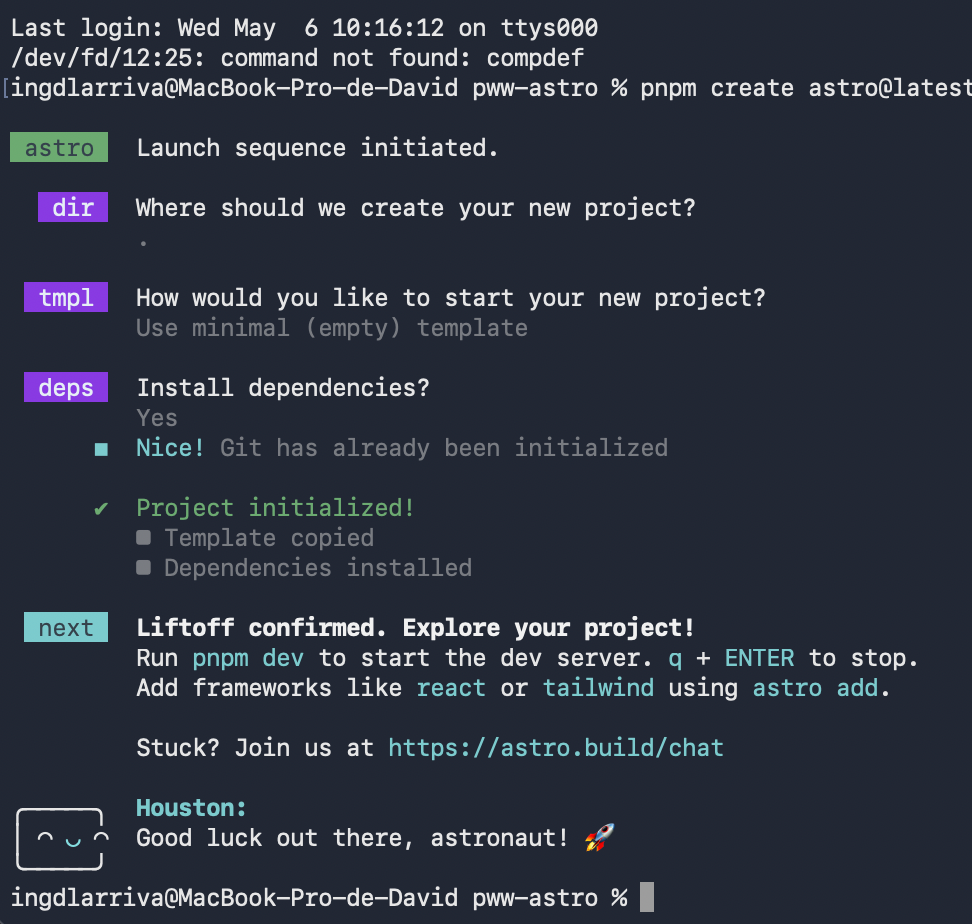
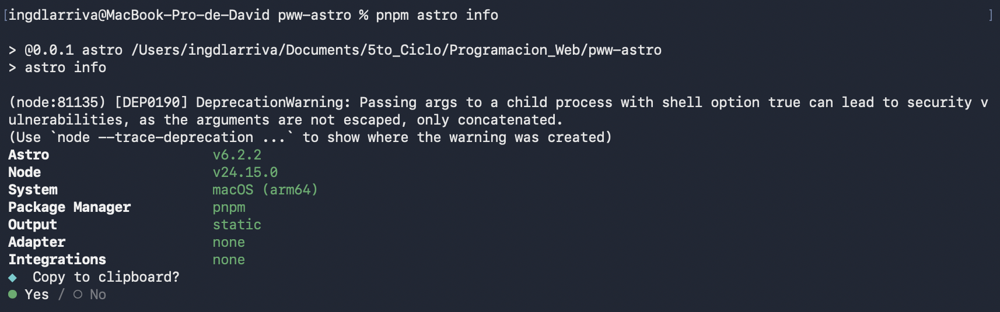
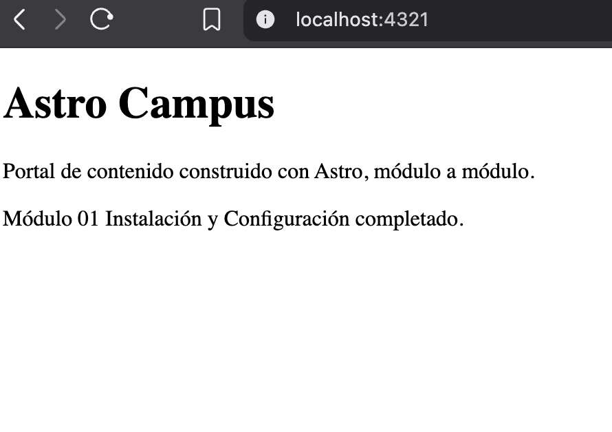
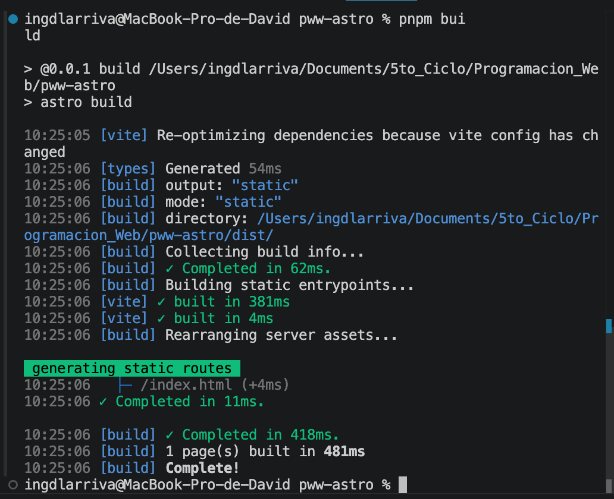
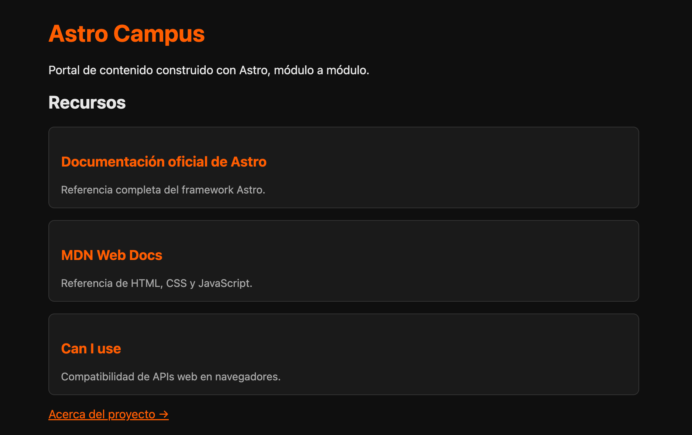
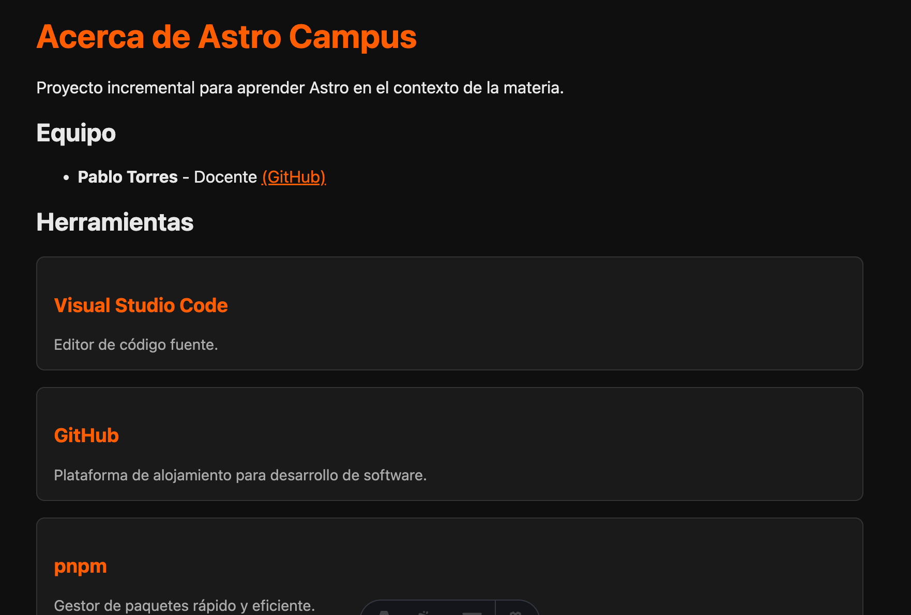

# Prácticas de Astro - PPW

**Autor:** David Alejandro Larriva Castillo  
**Institución:** Universidad Politécnica Salesiana 

## Propósito del Proyecto
Este repositorio contiene el proyecto incremental `astro-campus`, un portal de contenido construido con Astro que se irá desarrollando módulo a módulo a lo largo de la asignatura.

### Práctica 01: Instalación y Configuración
- Inicialización del proyecto base de Astro utilizando la plantilla minimalista.
- Configuración del entorno en el archivo `astro.config.mjs` estableciendo la salida como estática (`output: 'static'`).
- Modificación inicial del archivo `index.astro` para establecer la página de bienvenida.
- Verificación del servidor de desarrollo y del proceso de empaquetado (build) para producción

### Práctica 02: Fundamentos de Astro
- Creación de un componente reutilizable `RecursoCard.astro` con tipado estricto mediante `interface Props`.
- Desarrollo de la página `about.astro` integrando información del equipo y renderizando una lista de herramientas.
- Implementación de renderizado condicional moderno en Astro para validar variables de entorno (modo producción vs. modo desarrollo).
- Integración de componentes dentro de la página de inicio iterando sobre arreglos de datos.

---

## Evidencias

Las capturas de pantalla que validan la correcta ejecución de los comandos y la visualización de los componentes se encuentran en el directorio `assets/`.

### Evidencias - Práctica 01

**1. Proceso de creación del proyecto:**


**2. Salida de pnpm astro info:**


**3. Sitio corriendo en localhost:4321:**


**4. Salida del build de producción:**


### Evidencias - Práctica 02

**5. Página de inicio (index) mostrando la lista de recursos con tarjetas:**


**6. Página Acerca del proyecto (about) con renderizado condicional:**


---

## Instrucciones de Ejecución
Para arrancar el servidor de desarrollo local, clona este repositorio y ejecuta los siguientes comandos en la terminal utilizando `pnpm`:
```bash
pnpm install
pnpm dev